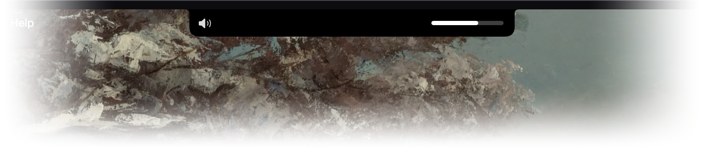
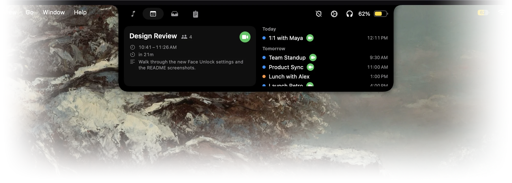
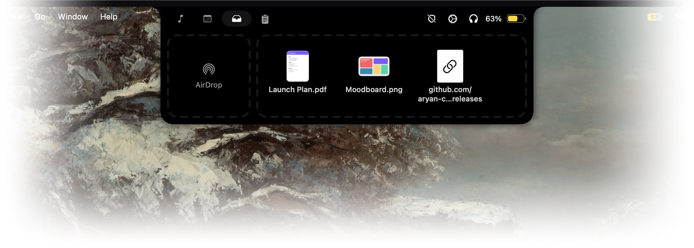
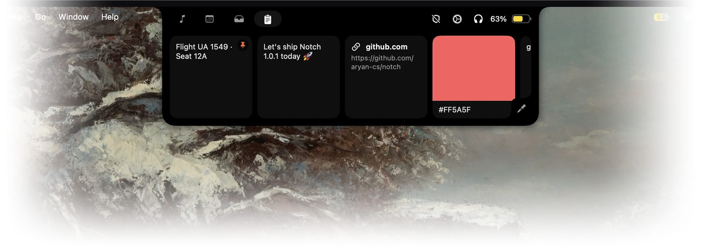
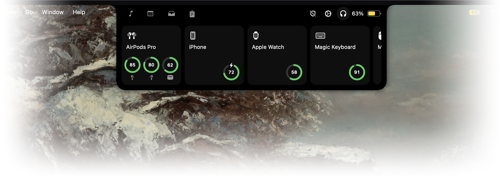
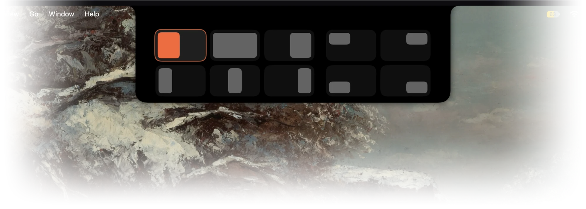
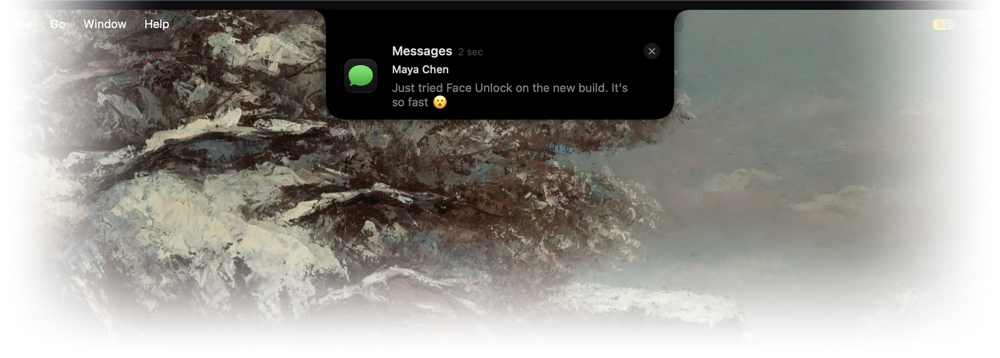
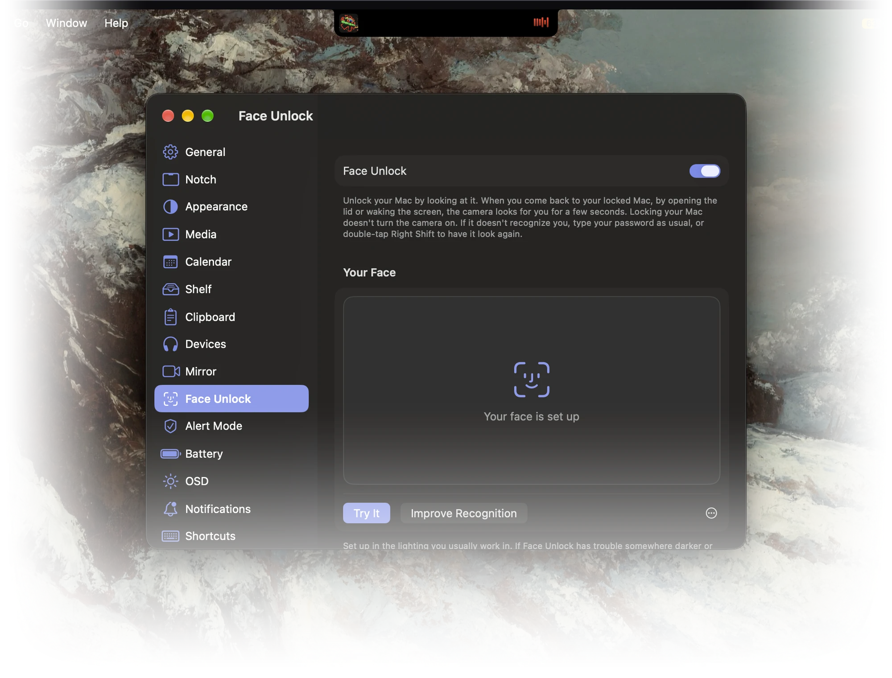

# The Notch guide

This guide covers everything Notch can do and how to set it up. If you just want the quick tour, see the [README](README.md).

A note on names: **Notch** with a capital N is the app, and **the notch** is the black area at the top of your screen.

## Contents

- [Installing](#installing)
- [Your first launch](#your-first-launch)
- [Getting around](#getting-around)
- [Music](#music)
- [Volume and brightness](#volume-and-brightness)
- [Battery](#battery)
- [Calendar](#calendar)
- [Shelf](#shelf)
- [Clipboard history](#clipboard-history)
- [Devices](#devices)
- [Window snapping](#window-snapping)
- [Mirror](#mirror)
- [Notifications](#notifications)
- [Face Unlock](#face-unlock)
- [Alert mode](#alert-mode)
- [Displays, full screen and the lock screen](#displays-full-screen-and-the-lock-screen)
- [Keyboard shortcuts](#keyboard-shortcuts)
- [Privacy](#privacy)
- [Updating](#updating)
- [Troubleshooting](#troubleshooting)
- [Uninstalling](#uninstalling)
- [Building from source](#building-from-source)
- [Credits and license](#credits-and-license)

## Installing

You'll need macOS 14 Sonoma or later. Notch runs on any Mac. On Macs without a notch, and on external displays, it draws a small notch-shaped pill at the top of the screen instead.

1. Download **Notch.dmg** from the [latest release](https://github.com/aryan-cs/notch/releases/latest).
2. Open it and drag Notch into your Applications folder. Opening Notch straight from the disk image doesn't install it.
3. Eject the disk image and open Notch from Applications.

Notch isn't notarized by Apple, so the first time you open it, macOS will say it can't check the app. You only have to get past this once. The most reliable way is this Terminal command:

```bash
xattr -dr com.apple.quarantine /Applications/Notch.app
```

If you'd rather not use Terminal, try to open Notch, close the warning, then go to **System Settings → Privacy & Security**, scroll down and click **Open Anyway**. This doesn't work on every account, so fall back to Terminal if it fails.

If you use the original Boring Notch, quit it and delete it before installing. Both apps use the same ID, so macOS treats them as one app and they'd share settings.

A few features need specific hardware. Face Unlock needs a built-in camera, like the one in a MacBook or iMac. Battery levels for your iPhone, iPad and Apple Watch need an Apple Silicon Mac. The live audio waveform in the music player needs macOS 14.2.

## Your first launch

The first time Notch opens, it walks you through a few permission screens. Each one has **Allow Access** and **Not Now**. You can skip any of them, and the feature that needs it will ask again later.

| Permission | What uses it |
|---|---|
| Camera | Mirror, Face Unlock, and Alert mode's quick face check |
| Calendars and Reminders | The Calendar tab |
| Accessibility | The volume and brightness display, window snapping, notifications, pasting from your clipboard history, Face Unlock entering your password, and the Battery menu |
| Bluetooth | Devices and Alert mode |
| Audio recording | The live waveform in the music player |
| Automation | Controlling Apple Music and Spotify directly |

Accessibility is the one most features need. Newer versions of macOS may call it something else, like **Device Control and Data Access**. Notch always shows the name your Mac uses.

## Getting around

Move your pointer up to the notch and it opens after a moment. You can also click it, swipe down on it with two fingers, or press **⇧⌘I**. To close it, move away, swipe up, or press **⇧⌘I** again.

Across the top left are tabs. **Home** shows your music and is always there. **Calendar**, **Shelf** and **Clipboard** show up when those features are on. The top right has buttons for the camera mirror, Alert mode, Settings, your devices, and your battery level.

Even closed, the notch keeps you posted. It shows the volume or brightness as you change it, charging changes, what's playing, and notifications if you turn them on. When music is showing, swipe left or right on the notch to skip tracks.

Notch doesn't put an icon in the Dock. Open Settings from the sparkle icon in the menu bar, the gear in the open notch, or by right-clicking the notch. The menu bar icon also has **Check for Updates…**, **Restart Notch** and **Quit**. **Settings → General** is where you'll find **Launch at login**, the language, and which display the notch appears on.

## Music

Notch shows what's playing on your Mac with album art, the song and artist, a progress bar and playback buttons. Click the album art to jump to the app that's playing. The progress bar and accent colors follow the album art.

Pick where your music comes from in **Settings → Media → Music Source**:

- **Now Playing** works with almost any app that plays audio, including your browser. It's the default.
- **Apple Music** and **Spotify** control those apps directly, which adds favoriting and volume. macOS asks for Automation permission the first time.
- **YouTube Music** works with the [YouTube Music desktop app](https://github.com/th-ch/youtube-music), not the website.

Under **Media controls**, choose the five buttons the player shows by dragging them onto the slots: shuffle, previous, play/pause, next, repeat, favorite, volume, 15-second skips and audio output. **Reset to Defaults** puts them back. Favorite works with Apple Music and YouTube Music, and volume works with Apple Music and Spotify.

The same page lets you show lyrics under the artist name (they come from lrclib.net), turn on the live audio waveform, and decide whether the notch hides when an app is full screen. When the song changes, a "sneak peek" can briefly show the new song under the notch. Press **⇧⌘H** to show it any time.

## Volume and brightness

Notch can replace the macOS volume, brightness and keyboard backlight pop-ups with a slimmer one in the notch. You can drag its bar to set the level.

To turn it on, go to **Settings → OSD**, switch on **Replace System OSD**, and allow Accessibility when asked. Notch needs that to see your volume and brightness keys. **Use inline style** shows the level inside the closed notch instead of below it.

<p align="center"></p>

If you use [BetterDisplay](https://betterdisplay.pro) or [Lunar](https://lunar.fyi) for external screens, pick them as the brightness source. They need to be installed and running. Hold **Option** with a volume or brightness key to open the matching System Settings page, or **Option and Shift** to change the level in smaller steps.

## Battery

Your battery level sits in the top right of the open notch. When you plug in, unplug, finish charging or switch Low Power Mode, the closed notch widens for a moment to tell you.

Click the battery icon to open the same Battery menu you'd get from the menu bar. That needs Accessibility, and the system battery icon has to be showing in your menu bar. Otherwise Notch shows its own panel with your battery's health and the time until full or empty. You can turn off the indicator, the percentage, the wattage or the alerts in **Settings → Battery**.

## Calendar

The Calendar tab shows your upcoming events and reminders.

<p align="center"></p>

To set it up:

1. Open **Settings → Calendar** and turn on **Show calendar**. It's off by default.
2. Allow calendar and reminders access when macOS asks.
3. Pick a **Layout**. **Up next** shows your next event with the week beside it. **Month and agenda** shows a small month, and clicking a day lists the week from there. **Multi-day** shows four days side by side.
4. Turn off any calendars or reminder lists you don't want to see.

Notch shows whatever is in the macOS Calendar and Reminders apps, including iCloud, Exchange and Google. To add a Google account, use **System Settings → Internet Accounts**. There's a shortcut button on the Calendar settings page.

Events with a Zoom, Google Meet, Microsoft Teams, Webex, Whereby or Jitsi link get a green video button next to their name. Click it to join. With **Join meeting when tapping an event** on, clicking anywhere on the event joins too. Right-click an event to open it in Calendar or copy the meeting link.

## Shelf

Drag files to the notch and three drop areas appear. Drop on **AirDrop** (or another share service you pick) to send files right away. Drop on **the shelf** to keep files there for later and drag them out when you need them.

<p align="center"></p>

The third area holds quick actions, shown when they fit what you're dragging. **Convert** turns images into JPEG, PNG, HEIC or TIFF, and video into MP4, MOV or audio-only M4A. Hover over Convert for a moment to pick the format. **Remove BG** cuts the subject out of a photo, and **Zip** and **Unzip** do what you'd expect.

Results land on the shelf and your originals stay untouched. They're temporary copies, so drag them somewhere to keep them. Right-click anything on the shelf to open it, show it in Finder, Quick Look it, rename it, share it or copy its path. More options are in **Settings → Shelf**.

## Clipboard history

Notch can remember what you copy: text, images, links to files and colors.

<p align="center"></p>

Turn it on with **Enable clipboard history** in **Settings → Clipboard**. It keeps 50 items by default, and pinned items don't count toward that. You can set a keyboard shortcut for it in **Settings → Shortcuts**.

Open the **Clipboard** tab, or press your shortcut, and click an item to copy it again. If you turn on **Paste into the active app when you choose an item**, Notch pastes it for you. That needs Accessibility. Hover an item to pin or delete it. The eyedropper picks a color from anywhere on your screen, and right-clicking a color copies it as hex, RGB, HSL or code.

Copies that password managers mark as private are never saved. Neither is anything you copy while Keychain Access, Passwords, 1Password, Bitwarden or KeePassXC is in front, and you can add more apps under **Ignored Apps**. Your history stays on your Mac but isn't encrypted. Use **Clear History…**, or turn off **Keep history after quitting**, if you'd rather not keep it.

## Devices

Click the headphones in the open notch to see your devices and their batteries. AirPods show each bud and the case.

<p align="center"></p>

The list includes Bluetooth devices paired with your Mac, your Mac's sound outputs, and your iPhone, iPad and the Apple Watch paired with that iPhone. Click a device to connect it, and audio devices switch your sound to themselves. Right-click a card to disconnect it, play sound through it, find it in Find My, or open Bluetooth settings. New devices still have to be paired in Bluetooth settings first.

iPhones, iPads and Apple Watches are read over a USB cable or your Wi-Fi, about once a minute, on Apple Silicon Macs. The first time, plug your iPhone in and tap **Trust** if it asks. Notch then turns on the iPhone's "show on Wi-Fi" setting, the same one Finder uses, so it can read the battery without the cable later. A device that's out of reach keeps showing its last level, dimmed, for up to a week.

Notch asks for Bluetooth permission the first time you open Devices. Some devices, like many speakers, don't report a battery level.

## Window snapping

Drag a window by its title bar up into the notch. A grid of layouts opens: halves, thirds, quarters and full screen. Let go over one and the window fills that part of the screen. Move away from the notch to cancel.

<p align="center"></p>

Notch needs Accessibility to move other apps' windows. You can turn snapping off in **Settings → Notch**. Windows that can't be resized are moved but keep their size.

## Mirror

Mirror shows a small live view from your camera in the open notch, handy before a call. Turn it on in **Settings → Mirror**, pick a camera and shape, then click the camera button in the notch to start or stop it.

## Notifications

Notch can show notification banners in the notch instead of the corner of your screen. The app's icon appears in the closed notch, and opening the notch shows the whole message. Click it to open the app, or the × to dismiss it.

<p align="center"></p>

Turn on **Show notifications in the notch** in **Settings → Notifications** and allow Accessibility. Then either turn on **From all apps** or add the apps you want. Nothing shows up until you do one or the other. Notch only copies banners that actually appear, so notifications silenced by Focus won't show here either.

## Face Unlock

Face Unlock signs you in when it sees your face, like Face ID on an iPhone. When you come back to your locked Mac, a Face ID box appears and the camera looks for you. If it recognizes you, the box turns into a green smiley face and your Mac unlocks.

<p align="center"></p>

Notch learns your face from a few camera frames and keeps a numeric fingerprint of it, never photos. To unlock, it types your Mac password for you, which is why it needs your password and Accessibility.

### Setting it up

1. Open **Settings → Face Unlock** and turn on **Face Unlock**.
2. Click **Set Up Face**, look at the camera, and slowly turn your head a little until the bar fills. Do this in the lighting you usually work in.
3. Click **Try It** to check that it knows you. If it struggles somewhere darker or brighter, go there and click **Improve Recognition**.
4. Type your Mac password under **Mac Password** and click **Save Password**. Notch checks it against your account first, so a typo is caught right away.
5. Make sure **Camera** and **Accessibility** both have a green check under **Access**.

If anything is missing, an orange note under the switch tells you what's left.

<p align="center"></p>

### Using it

Locking your Mac doesn't start the camera, whether you press the Touch ID button, use **Control-Command-Q** or close the lid. Locking usually means you're walking away. Face Unlock starts when you come back: when you open the lid, or when you wake the screen after it has gone dark.

It looks for you for about five seconds. If it doesn't recognize you, the box shakes and goes away and the camera turns off, so you can type your password as usual. It won't keep restarting while you type. To have it look again, double-tap **Right Shift**. You can change that key, or turn it off, under **Lock Screen → Try again**.

### Security settings

**Photo protection** stops someone from holding up a picture of you. **Standard**, the default, waits for a blink or a small head movement. **Strict** waits for a blink. **Off** only checks that the face matches.

**Matching** slides from **Easier** to **Stricter**. Stricter is harder for someone else to get past, but may need better lighting to recognize you.

### Before you rely on it

Face Unlock is a convenience, not extra security. It uses your Mac's regular camera, not a depth sensor like Face ID, so a good video of you could fool it.

Your password is saved on your Mac in a file only your user account can read. It's scrambled, but it isn't protected the way the macOS Keychain protects passwords, so other programs running as you could read it. It's only ever used to unlock your screen.

If you change your Mac password, update it under **Mac Password → Change**. Otherwise Face Unlock will type the old one and fail.

Face Unlock only uses your Mac's built-in camera. External webcams, Continuity Camera and virtual cameras are ignored on purpose, so nobody can feed it a recording. It works while you're logged in, so after a restart you'll still type your password once.

## Alert mode

Alert mode is for when you don't want someone reading your screen. While you're at your Mac, it listens over Bluetooth for nearby Apple devices like iPhones, Watches and AirPods. When more show up than usual, the camera does a quick check for a second face. If it finds one, Notch turns on Do Not Disturb until they leave, so your notifications stay private.

macOS doesn't let apps switch Focus directly, so you'll create two small shortcuts once:

1. In the **Shortcuts** app, make a new shortcut named exactly **Notch Focus On**.
2. Add the **Set Focus** action and set it to turn **Do Not Disturb** on.
3. Make a second one named exactly **Notch Focus Off** that turns Do Not Disturb off.

Back in **Settings → Alert Mode**, click the refresh button and both should show as found.

Turn Alert mode on with the shield in the open notch, or in **Settings → Alert Mode**, and allow Bluetooth and camera access. At first it learns how many devices are normally around you. If your own iPhone or AirPods get counted as visitors, click **Recalibrate** while you're alone. **Sensitivity** sets how close a device has to be, from about arm's length to two or three meters.

It pauses when you step away, when your Mac is locked or asleep, and when Bluetooth is off. Do Not Disturb turns off 30 seconds after the extra devices leave. The camera checks for a few seconds at most once a minute, and nothing it sees is saved.

## Displays, full screen and the lock screen

In **Settings → General → Display behavior**, choose whether the notch appears on your main display, follows whichever display you're using, or shows on all of them. With all displays, **⇧⌘I** opens the notch on the screen your pointer is on.

On screens without a notch, Notch draws a pill at the top center. Set its height in **Settings → Notch → Sizing**. The same page has the hover delay, animations, haptics, gestures, and **Compact mode**, which shows a smaller notch with just the music player.

**Settings → Media → Full screen behavior** decides whether the notch hides when apps go full screen. **Hide from screen recording**, in **Settings → Notch**, keeps the notch out of screenshots and recordings. **Show notch on lock screen** keeps it visible while your Mac is locked. Face Unlock's box appears either way.

## Keyboard shortcuts

You can change these in **Settings → Shortcuts**.

| Shortcut | What it does |
|---|---|
| ⇧⌘I | Opens or closes the notch |
| ⇧⌘H | Shows the song that's playing |
| Not set by default | Opens the notch on the Clipboard tab |
| Double-tap Right Shift, at the lock screen | Makes Face Unlock look again |

## Privacy

Notch has no analytics, tracking or crash reporting, and no account. Almost everything happens on your Mac.

The camera only turns on for Mirror, for Face Unlock's few seconds when you come back or its setup in Settings, and for Alert mode's quick checks. Frames are never saved or sent anywhere. Face Unlock stores a numeric fingerprint of your face, not photos, plus your password as described above. Your clipboard history, calendars, reminders and notifications stay on your Mac.

Notch only goes online to fetch lyrics from lrclib.net if you turn lyrics on, to load a small animation for the music player, and when you click **Check for Updates…** or a link on the About page. The YouTube Music source talks to the app on your own Mac. Reading your iPhone's battery over Wi-Fi turns on its Wi-Fi sync setting, as described under [Devices](#devices).

## Updating

Notch doesn't update itself. Choose **Check for Updates…** from the menu bar icon to open the [releases page](https://github.com/aryan-cs/notch/releases). Download the new **Notch.dmg**, quit Notch, and replace the app in Applications. Your settings, face and password stay where they are.

Because Notch isn't signed with an Apple Developer ID, macOS may treat a new version as a new app. You may need to get past the first-launch warning again, and it may ask for some permissions again. If something stops working after an update, open **System Settings → Privacy & Security**, find the permission (usually Accessibility), and turn Notch off and on.

## Troubleshooting

**The notch doesn't open when I hover.** Check **Open notch on hover** in **Settings → Notch**. If nothing responds at all, choose **Restart Notch** from the menu bar icon.

**I still see the macOS volume pop-up.** Turn on **Replace System OSD** in **Settings → OSD** and make sure Notch has Accessibility. External screens need BetterDisplay or Lunar for brightness.

**No music shows up.** Try a different **Music Source** in **Settings → Media**. If you picked Apple Music or Spotify, check that Notch is allowed under **System Settings → Privacy & Security → Automation**.

**My calendar is empty.** Turn on **Show calendar**, allow calendar access, and make sure your calendars are switched on in the list.

**Face Unlock doesn't start when I come back.** It starts when you open the lid or wake the screen, not when you lock. If you just locked and the screen is still on, double-tap **Right Shift**. If that does nothing, check for an orange note in **Settings → Face Unlock**. Face Unlock also needs a built-in camera, so it won't work with the lid closed.

**Face Unlock has trouble recognizing me.** Click **Improve Recognition** in the lighting where it struggles, and make sure your face is lit from the front. You can also move **Matching** a little toward **Easier**.

**Face Unlock recognizes me but doesn't unlock.** Check that Accessibility has a green check in **Settings → Face Unlock**, and that your saved password is current.

**Alert mode never turns on Do Not Disturb.** Make sure both shortcuts exist with exactly the right names and show as found in **Settings → Alert Mode**, and that camera and Bluetooth are allowed.

**Something stopped working after an update.** See [Updating](#updating). Turning Accessibility off and on for Notch usually fixes it.

**Anything else.** Click **Report a Bug** in **Settings → About**, which fills in your app and macOS versions, or [open an issue](https://github.com/aryan-cs/notch/issues).

## Uninstalling

1. Choose **Quit** from the Notch menu bar icon.
2. Drag Notch from Applications to the Trash.
3. To remove its data too, delete these two folders. In Finder, press **Shift-Command-G** and paste each path:
   - `~/Library/Containers/theboringteam.boringnotch` holds your settings, clipboard history and face data.
   - `~/Library/Application Support/theboringteam.boringnotch` holds the password saved for Face Unlock.
4. If you like, remove Notch from the lists in **System Settings → Privacy & Security**.

## Building from source

You'll need Xcode 26 or later.

```bash
git clone https://github.com/aryan-cs/notch.git
cd notch
open boringNotch.xcodeproj
```

Choose the **boringNotch** scheme and press **⌘R**. Xcode signs the app to run locally by default. If you set your own team under **Signing & Capabilities**, the permissions you grant will survive rebuilds.

The Face Unlock model is about 87 MB, so the first clone takes a little longer. The tool that reads iPhone, iPad and Apple Watch batteries is prebuilt in `AppleDevicesTools`. To rebuild it, install `libimobiledevice` with Homebrew and run `Configuration/apple-devices/build.sh`.

## Credits and license

Notch is built on [boring.notch](https://github.com/TheBoredTeam/boring.notch) by TheBoredTeam and its contributors, who made the app this one grew from. If you like the original, consider [supporting them](https://www.ko-fi.com/alexander5015).

It also uses [MediaRemoteAdapter](https://github.com/ungive/mediaremote-adapter) for the Now Playing source, ideas from [NotchDrop](https://github.com/Lakr233/NotchDrop) for the shelf, [libimobiledevice](https://libimobiledevice.org) (LGPL 2.1, license included in `AppleDevicesTools`) for device batteries, and the [AdaFace](https://github.com/mk-minchul/AdaFace) face recognition model for Face Unlock. See [THIRD_PARTY_LICENSES](THIRD_PARTY_LICENSES) for the rest.

Notch is free software under the [GNU General Public License v3.0](LICENSE).
