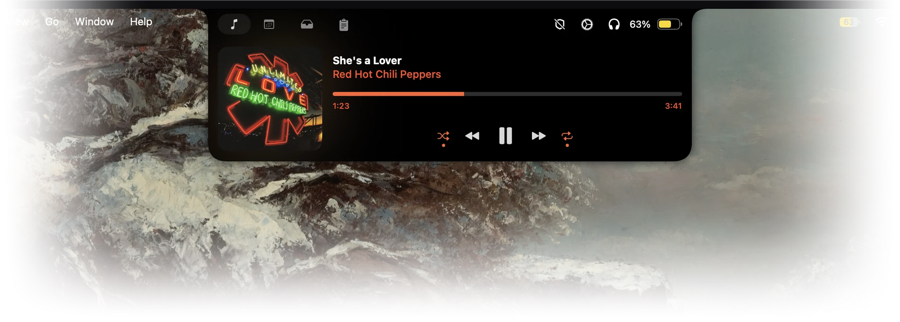
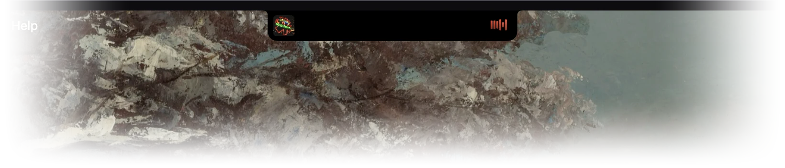

# Notch

Notch turns the notch on your Mac into a small control center. Move your pointer up to it and it opens to show your music, your calendar, files you've set aside, your clipboard history and your devices. It can also replace the volume pop-up, snap windows into place, and unlock your Mac when it sees your face.

<p align="center">
  
</p>

It's free, open source, and works on any Mac running macOS 14 or later, with or without a notch. Notch started as a fork of [boring.notch](https://github.com/TheBoredTeam/boring.notch).

## What it does

**Music.** See what's playing in any app and control it without switching windows. The colors follow the album art.

**Calendar.** Your next meeting and the rest of the week at a glance. Zoom, Meet and Teams calls get a join button.

<p align="center"></p>

**Shelf.** Drop files on the notch to keep them handy, AirDrop them, or convert, zip and unzip them on the way in.

<p align="center"></p>

**Clipboard history.** Everything you've copied, ready to copy again. Passwords from password managers are never saved.

<p align="center"></p>

**Devices.** Battery levels for your AirPods, iPhone, Apple Watch and keyboard, and one click to connect them.

<p align="center"></p>

**Face Unlock.** Come back to your Mac, look at the screen, and it unlocks, like Face ID on an iPhone.

<p align="center"></p>

**Window snapping.** Drag a window into the notch and drop it on a layout.

<p align="center"></p>

There's more: notifications in the notch, a cleaner volume and brightness display, battery status, a camera mirror, and Alert mode, which turns on Do Not Disturb when someone else is near your screen.

<p align="center"> </p>

## Install

1. Download **Notch.dmg** from the [latest release](https://github.com/aryan-cs/notch/releases/latest).
2. Open it and drag Notch into your Applications folder.
3. Notch isn't notarized by Apple, so macOS blocks it the first time. Run this once in Terminal, then open Notch:

   ```bash
   xattr -dr com.apple.quarantine /Applications/Notch.app
   ```

   You can also open it, then go to **System Settings → Privacy & Security** and click **Open Anyway**.

If you use the original Boring Notch, quit it and delete it first. The two apps share an ID and can't run side by side.

## Learn more

The [guide](GUIDE.md) walks through setting up each feature, what every permission is for, privacy, updating, and fixing common problems.

Want to build Notch yourself or help improve it? [CONTRIBUTING.md](CONTRIBUTING.md) explains how, and [ARCHITECTURE.md](ARCHITECTURE.md) shows how the code is organized.

## Credits

Notch is built on [boring.notch](https://github.com/TheBoredTeam/boring.notch) by TheBoredTeam and its contributors. It's free software under the [GPL-3.0 license](LICENSE).
